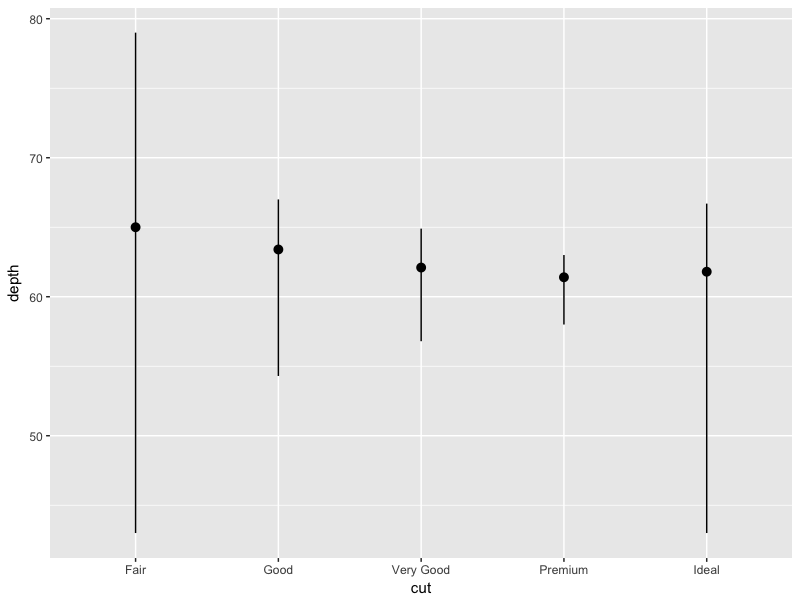
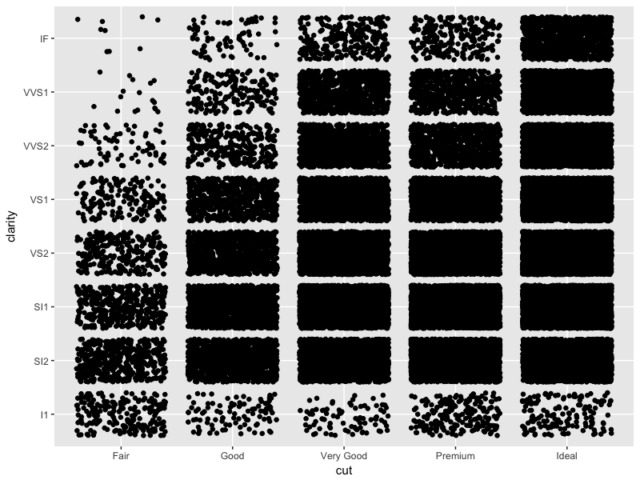
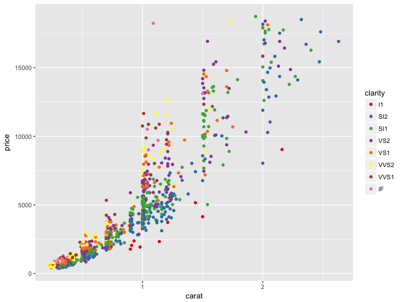
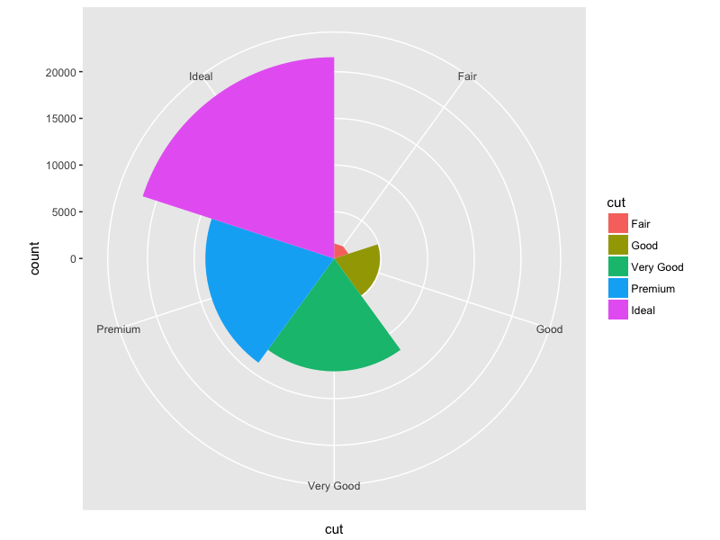
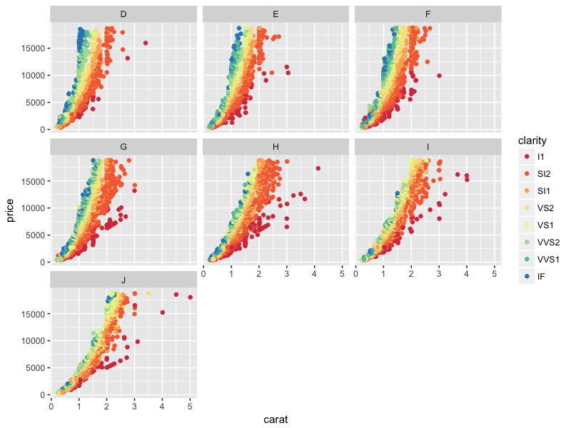

```{r setup, echo = FALSE, message = FALSE, warning = FALSE}
library('knitr')
library('dplyr')
library('ggplot2')
source("exercise.R")
setwd("~/Documents/ch13-ggplot2/exercise-2")

```

#Plots:
```{r pressure, echo=FALSE}





```

